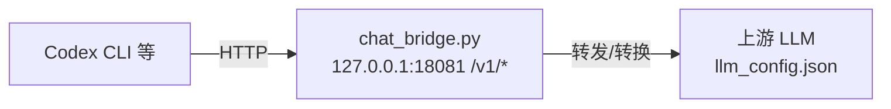

# Code_Bridge（Codex Chat Bridge）

**OpenAI 兼容 HTTP 桥**：在 `127.0.0.1:18081` 提供 `/v1/chat/completions`、`/v1/responses` 等，把 **Codex CLI**（及同类客户端）接到 **只暴露部分 API 的上游**（例如仅 [Responses API](https://platform.openai.com/docs/api-reference/responses)）。**生产用 `bridge/chat_bridge.py`（Python）**；Go 版见文末。

| 场景 | 处理 |
|------|------|
| API 形态不一致 | 上游只有 `/v1/responses`，客户端仍走 Chat Completions 等 → 本地 **转换与转发**。 |
| Codex 与 WebSocket | 内置 `openai` provider 可能走 `ws://.../v1/responses`；本桥仅 **HTTP POST**。自定义 provider（`.codex/config.toml`）设 `supports_websockets = false`，由桥与上游 HTTP 通信。 |
| 配置自环 | `llm_config.json` 的 `api_base_url` 填 **真实上游**，不要填本桥端口。 |



实现细节（流式 SSE、工具多轮等）见 `bridge/chat_bridge.py` 顶部与代码。

---

## 仓库结构

| 路径 | 说明 |
|------|------|
| `chat_bridge.py` | 入口：将 `bridge` 加入 `PYTHONPATH` 后调用 `bridge/chat_bridge.py` 的 `main()`。 |
| `bridge/chat_bridge.py` | **主实现**：FastAPI + Uvicorn；缺依赖时 **ThreadingHTTPServer**（simple-http）。 |
| `bridge/requirements.txt` | `fastapi`、`httpx`、`uvicorn`。 |
| `llm_config.json` | 上游地址、Key、默认模型；未传参时由桥读取。 |
| `.codex/config.toml` | Codex 示例：自定义 provider → `http://127.0.0.1:18081/v1`，关闭 WebSocket。 |
| `bridge/chat_bridge.go` | Go 版（对比用）。 |
| `bridge/stress_test/`、`bridge/stress_test.ps1` | 压测（可选）。 |
| `handler/codex_handler.go`、`plugin_spec.go` | 嵌入自有服务时的插件与路由示例。 |
| `logs/` | 会话日志等（若启用）。 |

---

## 环境

- Python **3.10+**
- 可访问的上游 OpenAI 兼容 API（`llm_config.json` 或命令行）
- **Codex 联调验证**：`codex-cli 0.118.0`（`codex --version`；其它版本自行验证）

---

## 快速开始

```bash
pip install -r bridge/requirements.txt
python chat_bridge.py
```

未传参时从项目根 `llm_config.json` 补全 `--upstream-base-url`、`--upstream-api-key`、`--default-model`。也可：

```bash
python bridge/chat_bridge.py ^
  --host 127.0.0.1 --port 18081 ^
  --upstream-base-url http://上游:端口/v1 ^
  --upstream-api-key 密钥 ^
  --default-model 模型名
```

`--use-codex-config` 可从 `~/.codex` 加载上游（见 `_load_codex_cli_config`）。

**自检**：

```bash
curl http://127.0.0.1:18081/health
curl http://127.0.0.1:18081/v1/models
```

健康检查为 JSON（`status`、`upstream_base_v1` 等）；FastAPI 与 simple-http 字段可能略有差异。

---

## 与 Codex CLI 配合

在 **`codex-cli 0.118.0`** 下联调通过；其它版本请自行验证。

1. 启动本桥。
2. 使用 `.codex/config.toml` 中 **`profiles.bridge`**：`model_provider = "code_bridge_http"` → `[model_providers.code_bridge_http]`，`base_url = "http://127.0.0.1:18081/v1"`，`wire_api = "responses"`，`supports_websockets = false`。
3. 在含该配置的仓库根执行：`codex -p bridge`。

`llm_config.json` 仍指向 **真实上游**；桥只在本机监听。

### 信任项目（否则 `config profile 'bridge' not found`）

Codex 仅在 **受信任项目** 加载仓库内 `.codex/config.toml`。在用户级 **`%USERPROFILE%\.codex\config.toml`**（Windows）或 **`~/.codex/config.toml`** 增加（路径改为你的仓库绝对路径，TOML 键加引号）：

```toml
[projects."E:/WorkSpace/Code_Bridge"]
trust_level = "trusted"
```

保存后在仓库根重试 `codex -p bridge`。也可在 Codex UI 中「信任此项目」。

### 项目根

默认向上查找含 **`.git`** 的目录为项目根。无 Git 可在根目录 `git init`，或用户级配置 `project_root_markers`（[高级配置](https://developers.openai.com/codex/config-advanced/)）。

### `--yolo`

只影响审批与沙箱，**不**等同于信任，**不**单独加载项目 `.codex/config.toml`。

### 不配信任时

把 `.codex/config.toml` 里的 **`[profiles.bridge]`** 与 **`[model_providers.code_bridge_http]`** 整段复制到 **`~/.codex/config.toml`**，`-p bridge` 可不依赖项目层加载（与团队配置冲突时自行合并）。

### Qwen/Qwen3.5-27B 与用户级 `model_providers`

`llm_config.json` 常有 `context_window = 256000` 时，在用户级 `~/.codex/config.toml` 为指向本桥的 provider 对齐窗口与压缩阈值；段名与 `model_provider` 一致（仓库用 `code_bridge_http` 则段名为 `[model_providers.code_bridge_http]`）。须与仓库 provider 段中的 **`wire_api` / `supports_websockets` / `requires_openai_auth`** 等同段或合并一致。

```toml
[model_providers.bridge]
name = "bridge"
base_url = "http://127.0.0.1:18081/v1"
network_access = "enabled"
model_context_window = 256000
model_auto_compact_token_limit = 245000
disable_response_storage = true
```

| 字段 | 说明 |
|------|------|
| `base_url` | 与 `python chat_bridge.py --port` 一致。 |
| `network_access` | 需联网工具时常设为 `"enabled"`。 |
| `model_context_window` | 与 `llm_config.json` 的 `context_window` 对齐示例。 |
| `model_auto_compact_token_limit` | 略小于窗口，留余量触发压缩。 |
| `disable_response_storage` | 按需关闭响应落盘。 |

缺少 `wire_api = "responses"`、`supports_websockets = false` 等仍可能走错协议；键名以 [Codex 配置参考](https://developers.openai.com/codex/config-reference/) 为准。

---

## HTTP 端点（Python 桥）

| 路径 | 说明 |
|------|------|
| `GET /health` | 健康与上游基址 |
| `GET /v1/models` | 模型列表（常代理上游） |
| `POST /v1/responses` | Responses |
| `POST /v1/chat/completions` | Chat Completions（可与 Responses 互转） |

路由见 `create_app`、`_run_simple_server` 内 `Handler`。

---

## 环境变量（节选）

| 变量 | 作用 |
|------|------|
| `CODEX_BRIDGE_LOG_DIR` | 日志目录（默认 `logs/`） |
| `CODEX_BRIDGE_RESPONSES_COMPAT_CHAT` | Chat 兼容逻辑（默认 `true`） |
| `CODEX_BRIDGE_RESPONSES_INPUT_AS_STRING` | input 以纯字符串发上游 |
| `CODEX_BRIDGE_RESPONSES_INPUT_STRING_RETRY` | 400 时尝试将列表 input 压成字符串重试 |
| `CODEX_BRIDGE_COMPAT_CHAT_STREAM` | 工具+流式时走 chat 流并翻译 SSE |
| `CODEX_BRIDGE_MAX_TOOL_CALL_ROUNDS` | 工具最大轮数（默认 `40`） |

完整定义见 `bridge/chat_bridge.py`。

---

## 联调与压测

无自动化测试目录；用 `curl /health`、`/v1/models` 或直连 `POST`。压测见 `bridge/stress_test/`、`bridge/stress_test.ps1`。

---

## Go 与插件

- **`bridge/chat_bridge.go`**：另一实现，参数见文件内 `flag`。
- **`plugin_spec.go`、`handler/`**：嵌入其它服务时的运维路由，**非**独立入口；与 Python 桥联用时注意 `bridge/chat_bridge.py` 路径。
- 仓库级短说明见根目录 **`SKILL.md`**（与本文不重复罗列步骤）。

---

## 常见问题

1. **`config profile 'bridge' not found`** → 信任项目或用户级合并 profile（上文「信任」「不配信任」）；在仓库根运行；根目录识别见「项目根」。
2. **WebSocket / 404** → 自定义 provider，`supports_websockets = false`，HTTP `/v1/responses`，勿让 Codex 直接 WS 上游。
3. **上游 400（input）** → `CODEX_BRIDGE_RESPONSES_INPUT_STRING_RETRY` 或 `CODEX_BRIDGE_RESPONSES_INPUT_AS_STRING`。
4. **日志过大** → `CODEX_BRIDGE_LOG_MAX_STR` 等（`_LOG_MAX_PAYLOAD_STR`）。

---

## 许可证

若无 `LICENSE`，使用前请按组织策略自行补充。
