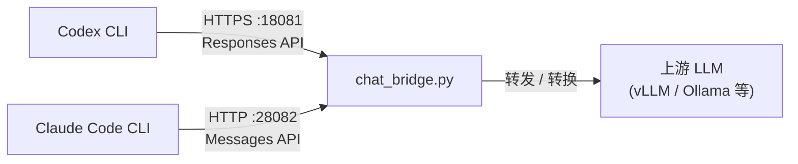

# Codex Bridge

本地 HTTP 桥，将 **Codex CLI** 和 **Claude Code CLI** 同时接到自定义上游 LLM（如 vLLM、Ollama 等 OpenAI 兼容后端）。



## 核心特性

| 特性 | 说明 |
|------|------|
| 双端口监听 | **18081**（HTTPS，OpenAI Responses API）+ **28082**（HTTP，Anthropic Messages API） |
| 协议转换 | Chat Completions ↔ Responses ↔ Anthropic Messages，自动适配上游格式 |
| 自签名 TLS | 启动时自动生成证书并安装到 Windows 信任库，Codex CLI 开箱即用 |
| WebSocket 降级 | 优雅接受并关闭 WebSocket 连接，Codex CLI 自动 fallback 到 HTTP POST |
| Thinking 模式 | 支持 `enable_thinking` / `reasoning_effort`，reasoning token 正确传递 |
| 工具调用 | 多轮 function_call 转换，循环检测保护（默认 10000 轮），单次对话最长 24 小时 |
| 流式 SSE | OpenAI SSE → Anthropic SSE 双向翻译 |

---

## 仓库结构

```
Codex_Bridge/
├── chat_bridge.py              # 入口（调用 bridge/chat_bridge.py）
├── bridge/
│   ├── chat_bridge.py          # 主实现：FastAPI + Uvicorn
│   ├── chat_bridge.go          # Go 版（实验性，仅供对比）
│   ├── requirements.txt        # Python 依赖
│   ├── start_bridge.bat        # Windows 快捷启动
│   ├── stress_test.ps1         # PowerShell 压测脚本
│   └── stress_test/            # Go 压测
├── llm_config.json             # 上游 LLM 配置（地址、Key、模型、参数）
├── .codex/config.toml          # Codex CLI 项目级 profile
├── claude_bridge_settings.json # Claude Code CLI 配置模板
├── handler/codex_handler.go    # 插件路由示例（可选）
├── plugin_spec.go              # 插件元数据（可选）
└── .gitignore
```

---

## 快速开始

### 1. 安装依赖

```bash
pip install -r bridge/requirements.txt
```

### 2. 配置上游

编辑 `llm_config.json`，指向你的 **真实上游 LLM**（不要填本桥端口）：

```json
{
  "api_base_url": "http://your-vllm-server:8000/v1",
  "api_key": "your-key",
  "model_name": "Qwen/Qwen3.5-27B"
}
```

### 3. 启动桥

```bash
python chat_bridge.py
```

桥会同时监听：
- **https://127.0.0.1:18081** — Codex CLI（OpenAI Responses API）
- **http://127.0.0.1:28082** — Claude Code CLI（Anthropic Messages API）

也可通过参数启动：

```bash
python bridge/chat_bridge.py \
  --host 127.0.0.1 --port 18081 \
  --claude-code-port 28082 \
  --upstream-base-url http://your-server:8000/v1 \
  --upstream-api-key your-key \
  --default-model Qwen/Qwen3.5-27B
```

### 4. 验证

```bash
curl -k https://127.0.0.1:18081/health
curl http://127.0.0.1:28082/health
```

---

## 与 Codex CLI 配合

### 全局配置（推荐）

编辑 `~/.codex/config.toml`：

```toml
model_provider = "codex_bridge"
model = "Qwen/Qwen3.5-27B"

[model_providers.codex_bridge]
name = "codex_bridge"
base_url = "https://127.0.0.1:18081/v1"
wire_api = "responses"
requires_openai_auth = true
```

确保 `~/.codex/auth.json` 存在（key 可以是任意值）：

```json
{"OPENAI_API_KEY": "dummy"}
```

然后直接运行：

```bash
codex --yolo
```

### 项目级配置

本仓库已包含 `.codex/config.toml`。信任项目后运行：

```bash
codex -p bridge
```

---

## 与 Claude Code CLI 配合

### 方法 1：修改全局 settings（推荐）

将 `claude_bridge_settings.json` 复制到 `~/.claude/settings.json`：

```powershell
Copy-Item claude_bridge_settings.json $env:USERPROFILE\.claude\settings.json
```

然后直接运行：

```bash
claude
```

### 方法 2：环境变量

```powershell
$env:ANTHROPIC_BASE_URL = "http://127.0.0.1:28082"
$env:ANTHROPIC_API_KEY = "dummy"
$env:ANTHROPIC_AUTH_TOKEN = "dummy"
$env:ANTHROPIC_MODEL = "Qwen/Qwen3.5-27B"
claude
```

> **注意**：`~/.claude/settings.json` 中的 `env` 优先级高于 shell 环境变量。

### 切换回真实 Claude API

```powershell
# 备份桥配置
Copy-Item $env:USERPROFILE\.claude\settings.json $env:USERPROFILE\.claude\settings.bridge.json

# 恢复真实 API 配置
Copy-Item $env:USERPROFILE\.claude\settings.json.bak $env:USERPROFILE\.claude\settings.json
```

---

## 命令行参数

| 参数 | 默认值 | 说明 |
|------|--------|------|
| `--host` | `127.0.0.1` | 监听地址 |
| `--port` | `18081` | Codex 端口（HTTPS） |
| `--claude-code-port` | `28082` | Claude Code 端口（HTTP），`0` 禁用 |
| `--upstream-base-url` | 从 `llm_config.json` | 上游 API 地址 |
| `--upstream-api-key` | 从 `llm_config.json` | 上游 API Key |
| `--default-model` | 从 `llm_config.json` | 默认模型 |
| `--timeout-sec` | `86400` | 上游请求超时（默认 24 小时） |
| `--ssl` / `--no-ssl` | `--ssl` | 是否启用 HTTPS（自签名证书） |

---

## HTTP 端点

### 18081 端口（Codex CLI）

| 方法 | 路径 | 说明 |
|------|------|------|
| GET | `/health` | 健康检查 |
| GET | `/v1/models` | 模型列表 |
| POST | `/v1/responses` | OpenAI Responses API |
| POST | `/v1/chat/completions` | Chat Completions |
| WS | `/v1/responses` | WebSocket（优雅关闭，触发 HTTP 降级） |

### 28082 端口（Claude Code CLI）

| 方法 | 路径 | 说明 |
|------|------|------|
| GET | `/health` | 健康检查 |
| POST | `/v1/messages` | Anthropic Messages API（流式/非流式） |
| POST | `/v1/messages/count_tokens` | Token 计数估算 |

---

## 环境变量

| 变量 | 说明 |
|------|------|
| `CODEX_BRIDGE_RESPONSES_COMPAT_CHAT` | Responses → Chat 兼容（默认 `true`） |
| `CODEX_BRIDGE_COMPAT_CHAT_STREAM` | 流式转码（默认 `true`） |
| `CODEX_BRIDGE_RESPONSES_INPUT_AS_STRING` | input 以纯字符串发上游 |
| `CODEX_BRIDGE_RESPONSES_INPUT_STRING_RETRY` | 400 时重试字符串模式 |
| `CODEX_BRIDGE_MAX_TOOL_CALL_ROUNDS` | 工具最大轮数（默认 `10000`） |
| `CODEX_BRIDGE_TUI_SSE_COMPAT` | TUI SSE 兼容模式（默认 `true`） |
| `CODEX_BRIDGE_LOG_DIR` | 日志目录（默认 `logs/`） |
| `CODEX_BRIDGE_TIMEOUT_SEC` | 超时秒数（默认 `86400`，即 24 小时） |

---

## 常见问题

### 1. `Invalid HTTP request received` 大量刷屏

Codex CLI 尝试 WebSocket 连接。桥已内置 WebSocket 优雅关闭处理。若仍出现，检查是否正在运行旧版桥。

### 2. `Self-signed certificate detected`（Claude Code）

Claude Code 28082 端口使用 **plain HTTP**，不要在 `ANTHROPIC_BASE_URL` 中写 `https://`。正确值：`http://127.0.0.1:28082`。

### 3. `stream disconnected before completion`（Codex）

确认 Codex 配置的 `base_url` 使用 `https://`（18081 端口是 HTTPS）。

### 4. `config profile 'bridge' not found`

在 Codex 中信任项目，或将 profile 复制到 `~/.codex/config.toml`。

### 5. 上游 400 错误

尝试设置 `CODEX_BRIDGE_RESPONSES_INPUT_STRING_RETRY=true` 或 `CODEX_BRIDGE_RESPONSES_INPUT_AS_STRING=true`。

---

## 环境要求

- Python **3.10+**
- 可访问的上游 OpenAI 兼容 API
- Codex CLI 0.118.0+（其它版本自行验证）
- Claude Code CLI（可选）

---

## 许可证

MIT
